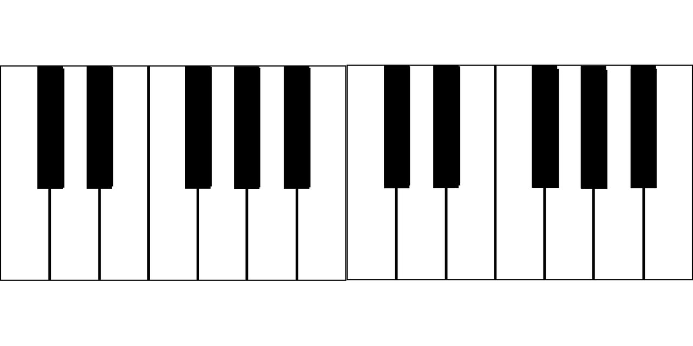
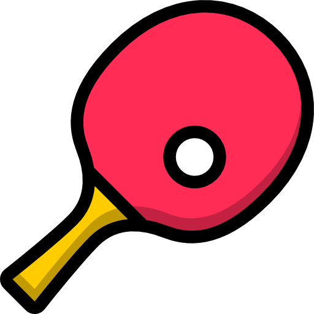

# Hi there, I'm Ali Muhammad Asad👋

## I'm an Undergrad Research Assistant, Aspiring Coder and Developer, Gamer, and a Teacher!
--------------------------------------------------------
Hi, I'm Ali Muhammad Asad, a Junior(third-year student) at **Habib University**

Being curious and interested, I've often found myself trying out different unique things, and solving puzzles and problems. Ever since I could remember, I've been trying my hand at plenty of things. Recently, I got hired as an Undergraduate Research Assistant under the supervision of a faculty member at my university, I'm also a part of the table tennis team and have represented my university on various occasions, and have been a Teacher's Assistant for various courses as well. Apart from the university, I also teach tuition privately, watch movies, and shows, and anime, read books, game excessively especially Minecraft and Rocket League, been teaching myself the piano and learning the violin.     

 
   Visitor count:
  
    
 

 

  
 

- 📖 Doing Bachelor's in Computer Science from Habib University
- 😅 Always Sleepy 😴😪💤
- 🔭 I’m currently working on [Myself](https://www.github.com/AliMuhammadAsad)!
- 🌱 I’m currently learning Web Development, and improving my portfolio 🥲
- 🥅 2023 Goals: Improve my portfolio significantly to land entry-level roles

## Connect With Me:
[][linkedin]
[][Gmail]
[][Outlook]
[][discord]
[][Facebook]
[][instagram]

 
 

## My Stack; Languages and Tools
<!-- 
 -->

<!-- 
 -->

<!--
**AliMuhammadAsad/AliMuhammadAsad** is a ✨ _special_ ✨ repository because its `README.md` (this file) appears on your GitHub profile.

Here are some ideas to get you started:

- 🔭 I’m currently working on ...
- 🌱 I’m currently learning ...
- 👯 I’m looking to collaborate on ...
- 🤔 I’m looking for help with ...
- 💬 Ask me about ...
- 📫 How to reach me: ...
- 😄 Pronouns: ...
- ⚡ Fun fact: ...
-->
<!--

  

-->

[Linkedin]:https://www.linkedin.com/in/ali-muhammad-asad/
[Instagram]:https://www.instagram.com/aliimuhammadasad/
[facebook]:https://www.facebook.com/alimuhammad73420
[discord]:https://discord.com/users/nightwing6973
[gmail]:mailto:alimuhammadasadlm10@gmail.com
[outlook]:mailto:aa07190@st.habib.edu.pk

